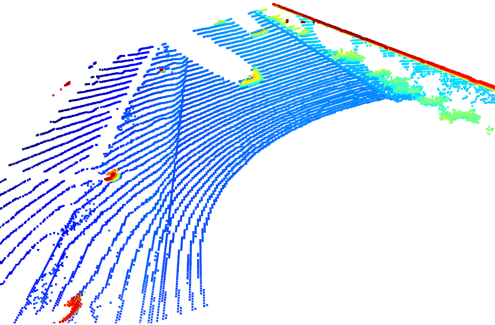

# 3D-Object-Detection
   This project use an 3D object detection using lidars data from [Waymo Open Dataset](https://waymo.com/open/). The original project files are from the related [Github repository](https://github.com/udacity/nd013-c2-fusion-starter).
   
## 1. Visualize range image channels (ID_S1_EX1)

    
    
   <em>Result of range image</em>

 
## 2. Visualize lidar point-cloud (ID_S1_EX2)

Write-up file where is the analysis of ID_S1_EX2 is  [HERE](Write-up.pdf). 

   
   
    
   <em>Result of point cloud visualization and range image </em>

## 3. Convert sensor coordinates to BEV-map coordinates (ID_S2_EX1)

    
    
   <em>BEV-map coordinates Frame 0 from Waymo Dataset</em>

## 4. Compute intensity layer of the BEV map (ID_S2_EX2) and Compute height layer of the BEV map (ID_S2_EX3)

    
    
   <em>Result of range image</em>

## 5. Add a second model from a GitHub repo (ID_S3_EX1) and Extract 3D bounding boxes from model response (ID_S3_EX2)
Obtain a second model fpn-resnet fron [ Super Fast and Accurate 3D Object Detection based on 3D LiDAR Point Clouds](https://github.com/maudzung/SFA3D).
| Frame 50 | Frame 51 |
| ------------- | ------------- | 
| 
     <em>BEV-map coordinates Frame 0 from Waymo Dataset</em> 
  |  
     <em>BEV-map coordinates Frame 0 from Waymo Dataset</em> 
 |

## 6. Compute intersection-over-union between labels and detections (ID_S4_EX1)

## 7. Compute false-negatives and false-positives (ID_S4_EX2)

## 8. Compute precision and recall (ID_S4_EX3)

| Pre-trained model from model zoo | Detectors Type | Speed (ms) | COCO mAP |
| ------------- | ------------- | ------------- | ------------- | 
| EfficientDet D1 640x640  | One-stage | 54 | 38.1 |
| SSD MobileNet V2 FPNLite 640x640 | One-stage | 39 | 28.2 |
| Faster R-CNN ResNet50 V1 640x640 | Two-stage | 53 | 29.3 |

**The selection of these models** was made based on their computational load and mAP characteristics. The EfficientDet D1 model is the one with the best precision of the selected models. However, in reference to the execution time the SSD MobileNet V2 FPNLite model has better performance due to its smaller size and low computational load of the three models presented. It's a good choice for real-time or resource-constrained applications. Faster R-CNN ResNet50 V1 is two-stage model, this causes a greater computational load and an increase in execution time, this model is selected with the purpose of establishing a comparison of results only, since for the application in autonomous vehicles it is not the most suitable model. 

## 2. Dataset
Front Camera Images from [Waymo Open Dataset](https://waymo.com/open/). Data are in TFRecord Format. 
## 3. Parameters of traning
| Setting | EfficientDet D1 | MobileNet V2 FPNLite| Faster R-CNN ResNet50 V1 |
| ------------- | ------------- | ------------- |  ------------- | 
| num_ephocs: |  2000 | 2000 | 2000 |
| optimizer: |   momentum_optimizer | adam_optimizer | momentum_optimizer|      
| learning_rate: |   cosine_decay_learning_rate | constant_learning_rate | cosine_decay_learning_rate|
| batch_size: | 8 | 8 | 8 |

**data_augmentation_options:** random_crop_image, random_horizontal_flip and random_scale_crop_and_pad_to_square.

## 4. Results with score greater than 60%
Of the three selected models we can see that the EfficientDet D1 model has the best performance and precision. This manages to detect vehicles and people with greater confidence, obtaining a total of 578 and 405 respectively. SSD MobileNet V2 FPNLite is the fastest model but it has a lower confidence, it detects only 5 people. Faster R-CNN ResNet50 V1 increases the confidence in the detection of people, however it has a poor result by obtaining many false positives in the detection of vehicles.

| Models | Video | All frames | 
| ------------- | ------------- | ------------- | 
| EfficientDet D1 640x64  |  |   |
| SSD MobileNet V2 FPNLite 640x640 |  |  |
| Faster R-CNN ResNet50 V1 640x640 |  |  |

### Training loss results
The loss graphs show the result of the training experiments. The best performance has the EfficientDet D1 model followed by the MobileNet V2 FPNLite SSD model and the lowest performance is Faster R-CNN ResNet50 V1.

It is important to mention that the Faster R-CNN ResNet50 V1 during training does not have a convergent loss graph to 0, therefore it have errors in detection, generating the excessive false positives mentioned above. It is recommended to perform more training tests with this model by changing the optimizer, the learning rate and the batch size to obtain better results.

## 5. Future training improvements
 **a. Increase the number of epochs:** It will lead to better training and convergence to smaller errors.
 
 **b. Change the optimizer:** Use in all experiments the ADAM optimizer that is mentioned in the literature as the optimizer with the best results.
 
 **c. Use other types of augmentation options:** Incorporate augmentations that improve the low lighting in the images.
 
 **d. Change batch size:** Try increasing the batch size and decreasing the learning rate to get a better training result. 

